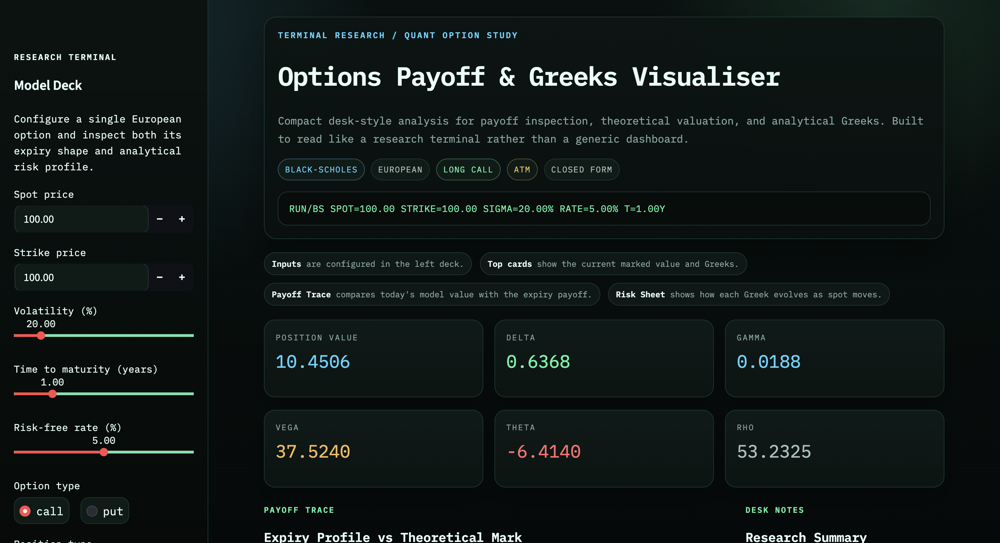
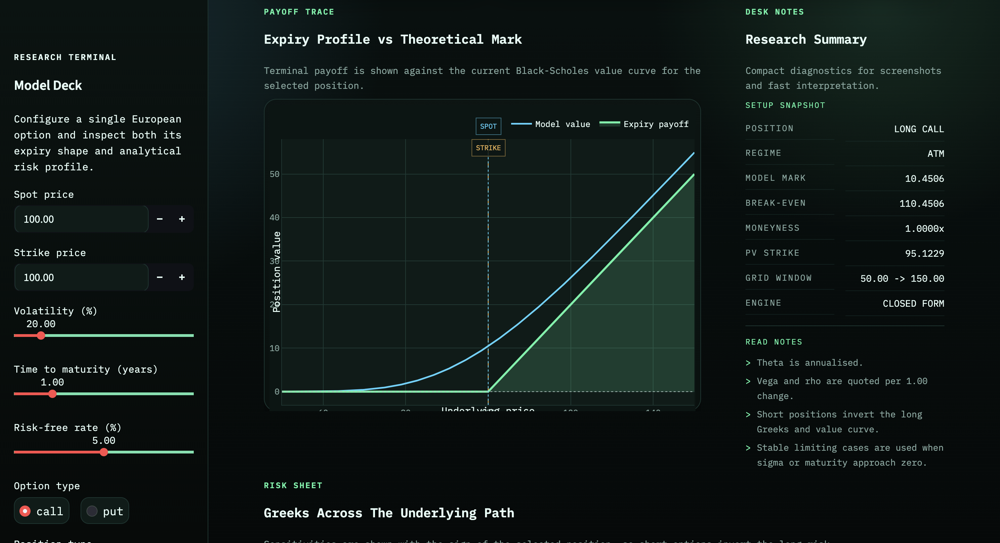
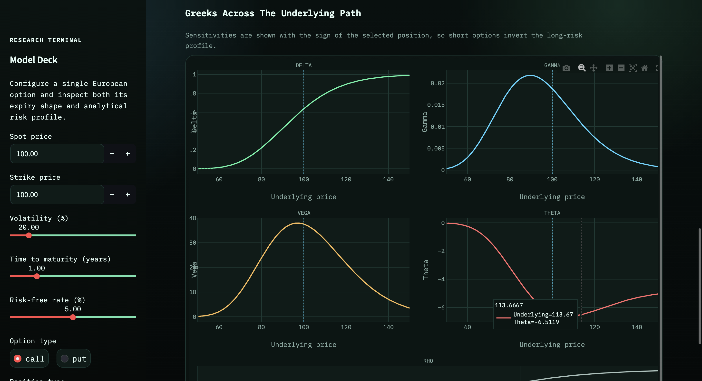

# Options Payoff & Greeks Visualiser

A compact Streamlit app for exploring European option payoffs and Black-Scholes sensitivities. The project is designed as a small quantitative finance portfolio piece: lightweight, mathematically grounded, and structured like a real application rather than a notebook or monolithic script.

## Project Overview

This app lets you:

- Price European calls and puts with the Black-Scholes model
- Visualise expiry payoff profiles for long and short option positions
- Inspect the five main analytical Greeks across a range of underlying prices
- Explore how spot, strike, volatility, rates, and maturity change the shape of the option profile

## Features

- Black-Scholes pricing for European call and put options
- Analytical Delta, Gamma, Vega, Theta, and Rho
- Expiry payoff charts for:
  - Long call
  - Short call
  - Long put
  - Short put
- Interactive Streamlit controls for core model inputs
- Clean Plotly visualisations for payoff, theoretical value, and Greeks
- Vectorised NumPy implementation with edge-case handling for very small maturity and volatility

## Screenshots

### Overview



### Payoff And Desk Notes



### Greeks Panel



## Tech Stack

- Python
- NumPy
- SciPy
- Plotly
- Streamlit

## Black-Scholes Model Summary

For spot price `S`, strike `K`, volatility `sigma`, risk-free rate `r`, and time to maturity `T`:

```text
d1 = [ln(S / K) + (r + 0.5 * sigma^2) * T] / (sigma * sqrt(T))
d2 = d1 - sigma * sqrt(T)
```

European call and put prices are:

```text
Call = S * N(d1) - K * exp(-rT) * N(d2)
Put  = K * exp(-rT) * N(-d2) - S * N(-d1)
```

where `N(.)` is the standard normal CDF.

For very small `T` or `sigma`, the implementation switches to stable limiting cases instead of forcing the standard formulas through numerically unstable inputs.

## What Each Greek Represents

- `Delta`: sensitivity of the option value to a small change in the underlying price
- `Gamma`: sensitivity of Delta to a small change in the underlying price
- `Vega`: sensitivity of the option value to a change in implied volatility
- `Theta`: sensitivity of the option value to the passage of time
- `Rho`: sensitivity of the option value to a change in the risk-free rate

## Project Structure

```text
.
├── assets/
│   └── screenshots/
│       ├── app-overview.png
│       ├── greeks-panel.png
│       └── payoff-desk-notes.png
├── app.py
├── greeks.py
├── payoff.py
├── pricing.py
├── requirements.txt
├── utils.py
└── README.md
```

## How To Run Locally

1. Create and activate a virtual environment.
2. Install dependencies:

```bash
pip install -r requirements.txt
```

3. Launch the app:

```bash
streamlit run app.py
```

Then open the local Streamlit URL shown in your terminal.

## Example Use Cases

- Compare the asymmetric payoff of a long call against the capped profile of a short call
- See how Gamma and Vega concentrate around the strike as expiry approaches
- Observe the effect of higher rates on call versus put Rho
- Inspect how Theta changes when an option moves from out-of-the-money to at-the-money

## Limitations

- European exercise only
- Constant volatility assumption
- Constant risk-free rate
- No dividends or carry adjustments
- Black-Scholes assumptions may not match real market microstructure or volatility smiles

## Future Improvements

- Multi-leg strategies and spreads
- Implied volatility solver and smile visualisation
- Monte Carlo pricing for path-dependent or non-closed-form products
